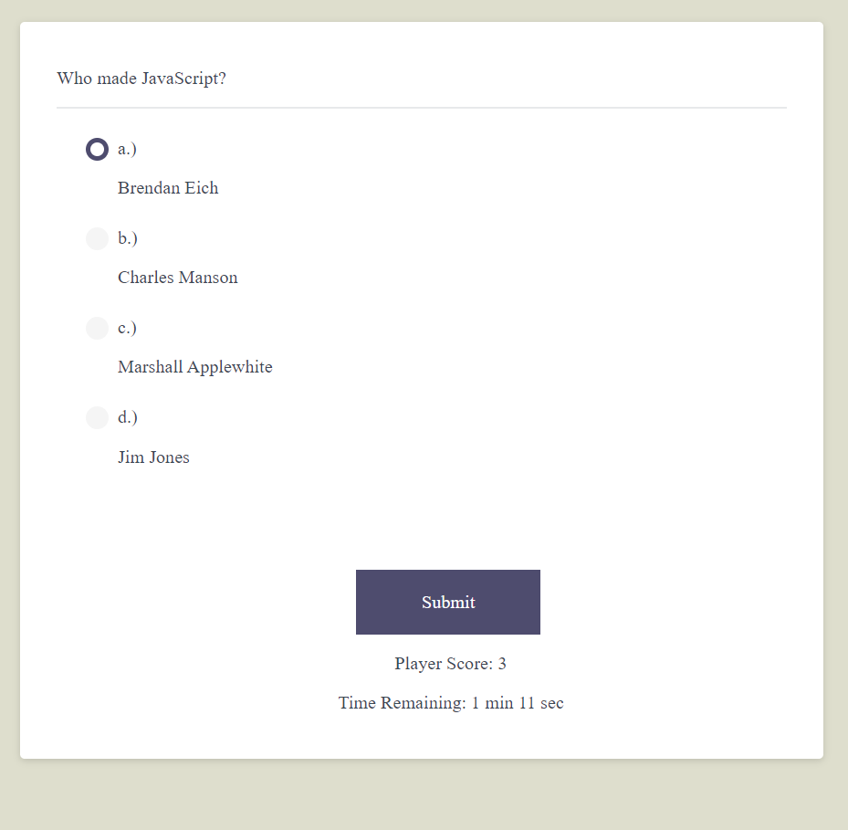

# homework4
Homework 4 - JavaScript Quiz

Created an application for answering multiple choice questions. Document pulls the questions from an easily modified object which is saved to questions.js. Some of the questions were borrowed from a similar test on WC3 Schools. The quiz is timed. Quiz ends when user answers all the questions or time runs out on the clock.

Currently I do not have the scoreboard working. I would also like to add an intro page where users press a button to begin the quiz. I would also like to still  clean up some of the code. The CSS file in particular was frankensteined from solutions available on WC3 schools and the css file from Homework 3. I feel like the page is reasonably responsive, but kind of suffers on especially large screens. I would like to go back and address that as well.

Application deployed at: https://myrmoxenus.github.io/homework4/

Screenshot: 

